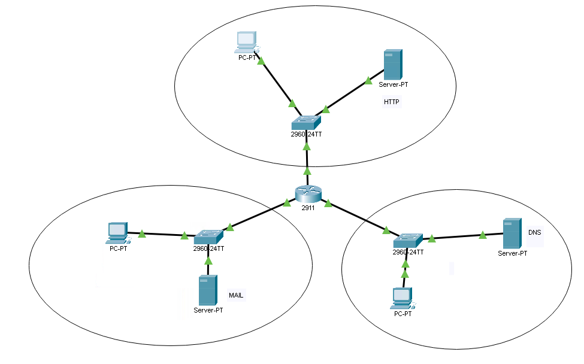
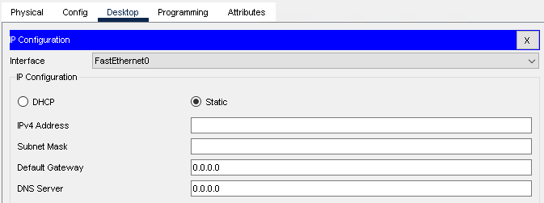
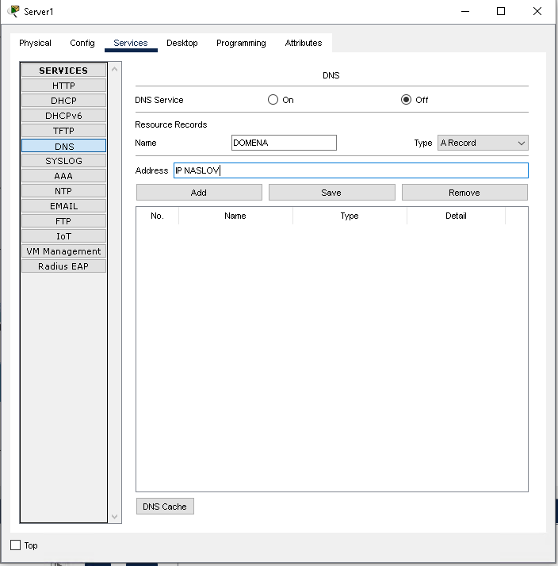
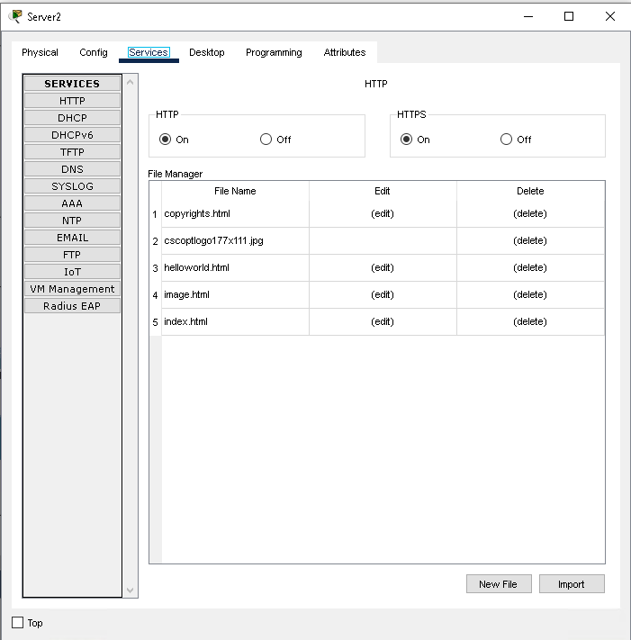
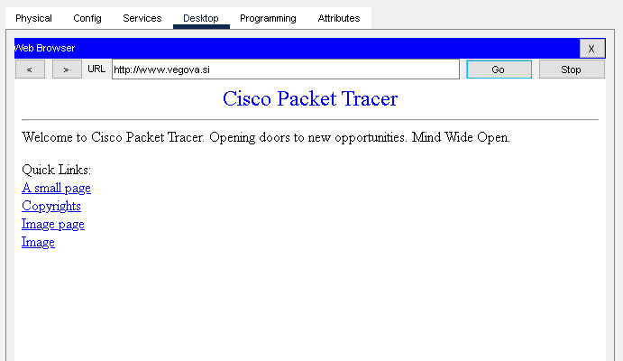
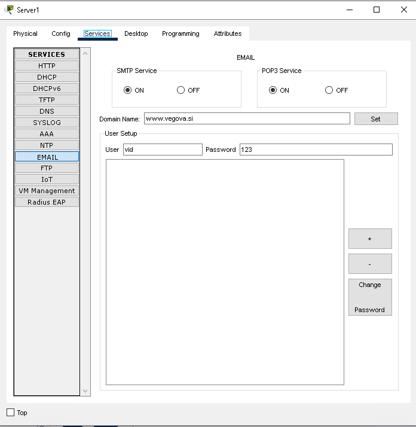
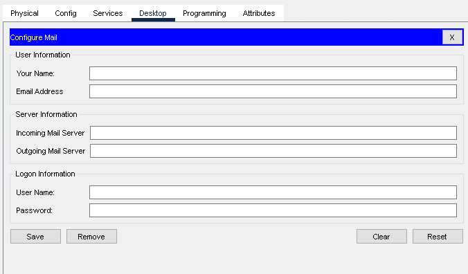

# LAV03 - Postavitev HTTP, DNS in mail strežnika

Namen vaje je postavili majhno "simulacijo" interneta, v kateri imamo lasten spletni (HTTP), DNS in e-poštni strežnik.



## Postopek

1. V programu Cisco Packet Tracer si postavite zgornjo topologijo. Za usmerjevalnik si lahko izberete poljubnega, pazite le da ima vsaj 3 `FastEthernet` ali `GigabitEthernet` vmesnike. Priporočam model 2911.

2. Na topologiji imamo 3 omrežja.
   1. Za zgornje omrežje določite omrežni naslov iz razreda A. V tem omrežju bo spletni strežnik.
   2. Za levo omrežje določite omrežni naslov iz razreda B. V tem omrežju bo DNS strežnik.
   3. Za desno omrežje določite omrežni naslov iz razreda C. V tem omrežju bo poštni strežnik.

3. Naredite skico omrežja (na papir ali direktno v Packet Tracerju).
    Označite si omrežja ter v vsakem omrežju računalniku dodelite prvi uporabni naslov, strežniku pa zadnjega. **Naslove si napišite na skico (zraven naprav)**

4. IP naslove iz skice nastavite računalnikom ter strežnikom. Ne pozabite tudi na maske ter privzete prehode (default gateway). Kot DNS strežnik zapišite naslov strežnika v desnem omrežju.

    

5. Nastavite IP naslove na usmerjevalnik. Pri tem vam bodo pomagali spodni ukazi:

    ```txt
    Router> enable
    Router# configure terminal

    # Spodnje ponovi za vse vmesnike (3x)
    Router(config)# interface <ime vmesnika>            # npr. gig0/0
    Router(config-if)# ip address <ip naslov> <maska>   # Nastavimo IP naslov
    Router(config-if)# no shutdown                      # Prižgemo vmesnik
    ```

6. Preverite povezljivost. Če ste IP naslove in privzete prehode nastavili pravilno boste lahko iz vsakege računalnika in strežnika pingali katerikoli drugi računalnik ali strežnik.

7. Na strežniku v desnem omrežju postavite DNS strežnik. Kliknite na strežnik, nato v zavihku "Services" vklopite DNS in nastavite zapise:
   - `www.vegova.si -> <naslov spletnega strežnika>`
   - `mail.vegova.si -> <naslov poštnega strežnika>`

    Zapis dodate tako, da v zgornje polje napišete domeno, v spodnje pa IP naslov, nato pa kliknete "Add".
    

8. Na strežniku v zgornjem omrežju postavite spletni strežnik. Kliknite na strežnik, nato pa v zavihku "Services" poskrbite da sta HTTP in HTTPS prižgana. Če želite lahko v `index.html` spremenite spletno stran.
    

9. Preverite ali HTTP in DNS strežnika delujeta. Na poljubnem računalniku odprite brskalnik (zavihek Desktop) ter obiščite `www.vegova.si`. Če se vam prikaže spodnja stran HTTP in DNS delata ok. Drugače preverite nastavitve DNS strežnika na računalnikih in storitve same.

    

10. Na strežniku v levem omrežju postavite poštni strežnik. Kliknite na strežnik, nato pa v zavihku "Services" vklopite SMTP in POP3. Nastavite še domeno za spletni strežnik ter ustvarite vsaj enega uporabnika. Ne pozabite klikniti "+" na desni strani.

    

11. Preverite ali pošta dela pravilo. Na poljubnem računalniku odprite email klient (zavihek Desktop) in nastavite zahtevane podatke. Kot incoming in outgoing mail server napišite `mail.vegova.si`, za Logon information pa podatke uporabnika, ki ste ga ustvarili na poštnem strežniku.
    

    Kliknite "Save", nato pa s "Compose" sami sebi pošljite sporočilo. Na koncu kliknite še "Receive" da poslano sporočilo preberete iz poštnega strežnika.
