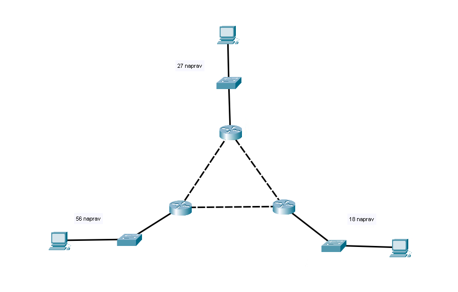

# LAV04 - Statično usmerjanje

Namen te vaje je postavitev omrežja s tremi usmerjevalniki z uporabo statičnega usmerjanja,
ter preveriti vsebino usmerjevalnih tabel usmerjevalnikov.

V programu Cisco Packet Tracer bomo postavili spodnjo topologijo, pri čemer bomo kot krovno omrežje uporabili `172.16.10.0/24`.



## Postopek

1. Postavite omrežje kot je prikazano na sliki zgoraj, uporabite lahko poljubne usmerjevalnike, poskrbite le, da imajo vsaj 3 FastEthernet ali GigabitEthernet vmesnike (primeren je na primer model 2911). Pazite na pravilno uporabo kablov.

2. Dano omrežje `172.16.10.0/24` razdelite na podomrežja, ki bodo zadostila zahtevam na zgornji sliki.

3. Naredite si skico omrežij (na papir ali direktno v Packet Tracerju). Označite si omrežja in IP naslove ter poimenujte usmerjevalnike. Nekaj predlogov za imena: `R-zgoraj`, `R-levo`, `R-desno`. Veliko lažje je najprej le načrtovati in nato le pisati ukaze kot pa oboje delati hkrati.

4. Konfigurirajte računalnike. Ne pozabite na privzete prehode (default gateway). DNS strežnik lahko pustite prazen, saj ga pri tej vaji ne bomo potrebovali.

5. Preimenujte usmerjevalnike v skladu s svojo skico. Ukaz za nastavljanje imena usmerjevalnika je

    ```txt
    Router(config)# hostname <ime>
    ```

6. Nastavite IP naslove na vmesnike usmerjevalnikov. Ukaz za to je

   ```txt
    Router(config)# interface <ime vmesnika>
    Router(config-if)# ip address <naslov> <maska>      # za IPv4
    Router(config-if)# ipv6 address <naslov>/<prefix>   # za IPv6
    Router(config-if)# no shutdown
    Router(config-if)# exit
    ```

7. Nastavite statične route, s katerimi usmerjevalnikom poveste za omrežja, ki niso neposredno povezana nanje. Ukaz za to je

    ```txt
    Router(config)# ip route <omrežje> <maska> <naslednji skok>
    ```

    Primera:

    ```txt
    Router(config)# ip route 192.168.1.0 255.255.255.0 10.0.10.1
    ```

    ali

    ```txt
    Router(config)# ip route 192.168.1.0 255.255.255.0 gig0/1
    ```

    Na primerih usmerjevalniku povemo, da lahko do omrežja `192.168.1.0/24` pride tako, da pošlje pakete na naslov `10.0.10.1` (prvi primer) ali preko vmesnika `gig0/1` (drugi primer). Obe opciji sta enakovredni.

8. Ko vsem usmerjevalnikom določite statične route do vseh omrežij preverite ali lahko vsak računalnik pinga vsakega drugega. V primeru, da ne imate nekje napako. Preverite:
   1. Ali imajo računalniki in usmerjevalniki pravilno nastavljene IP naslove?
    Za preverjanje IP naslovov na umerjevalniku lahko držite miško čez usmerjevalnik ali še bolje, uporabite ukaz:

        ```txt
        Router# show ip interface brief
        ```

   2. Ali imajo računalniki pravilno nastavljene privzete prehode?
   3. Ali imajo usmerjevalniki pravilno nastavljene statične route? Pri tem si pomagajte z ukazom

    ```txt
    Router# show ip route
    ```

    ki vam izpiše usmerjevalno tabelo usmerjevalnika, podobno kot je prikazano spodaj.

    ```txt
    Router#show ip route
    Codes: L - local, C - connected, S - static, R - RIP, M - mobile, B - BGP
        D - EIGRP, EX - EIGRP external, O - OSPF, IA - OSPF inter area
        N1 - OSPF NSSA external type 1, N2 - OSPF NSSA external type 2
        E1 - OSPF external type 1, E2 - OSPF external type 2, E - EGP
        i - IS-IS, L1 - IS-IS level-1, L2 - IS-IS level-2, ia - IS-IS inter area
        * - candidate default, U - per-user static route, o - ODR
        P - periodic downloaded static route

    Gateway of last resort is not set

        10.0.0.0/8 is variably subnetted, 6 subnets, 2 masks
    C       10.0.0.0/24 is directly connected, GigabitEthernet0/0
    L       10.0.0.1/32 is directly connected, GigabitEthernet0/0
    C       10.0.1.0/24 is directly connected, GigabitEthernet0/1
    L       10.0.1.1/32 is directly connected, GigabitEthernet0/1
    C       10.0.2.0/24 is directly connected, GigabitEthernet0/2
    L       10.0.2.1/32 is directly connected, GigabitEthernet0/2
    S    192.168.1.0/24 [1/0] via 10.0.0.2

    Router#
    ```

    Razlaga izpisa:
   - na vrhu je prikazana legenda vseh možnih načinov kako se je usmerjevalnik naučil poti do nekega omrežja. Mi do zdaj poznamo C (connected) in S (static).
   - nato nam usmerjevalnik sporoča, da "gateway of last resort" ni nastavljen. Tega bi nastavili z ukazom `ip route 0.0.0.0 0.0.0.0 <naslednji skok>` in se uporabi v primeru, da nobena od vrstic v usmerjevalni tabeli ne ustreza.
   - temu sledi sama usmerjevalna tabela. Vrstico z "variably subnetted" lahko ignorirate, saj je le zgodovinski ostanek iz časov, ko smo IP naslove delili v razrede A, B, C, ... Temu pa sledijo nam že poznane vrstice.
     - vrstice C pomenijo, da gre za omrežje, ki je neposredno povezano na usmerjevalnik
     - vrstice L pomenijo, da je to IP naslov, ki je nastavljen na usmerjevalniku (vidite da ima masko `/32`, kar pomeni da gre za "omrežje" z le enim naslovom)
     - vrstice S pomenijo, da je to statična pot, ki smo jo nastavili mi. V kvadratnih oklepajih sta napisana administrativna distanca in metrika, ki ju za enkrat lahko ignoriramo.

    V primeru, da ping paketki ne dosežejo cilja lahko preverite usmerjevalne tabele vsakega od usmerjevalnikov in ugotovite, če vsebujejo pravilne poti

9. Ko se vsi računalniki pingajo ste z nalogo zaključili. Lahko jo oddate na moodle ali pa predtem rešite še bonus nalogo.

## Bonus naloga

V svoje omrežje dodajte še IPv6, pri čemer vam je kot krovno omrežje dano `2001:db8:acad::/48`.
V 16 bitov, ki omrežju manjka do `/64` določite omrežja, ki jih boste uporabili.

Primer z drugačnim omrežjem:

```txt
Dano omrežje: 2001:dead:beef::/48

1. omrežje: 2001:dead:beef:1::/64
2. omrežje: 2001:dead:beef:2::/64
3. omrežje: 2001:dead:beef:3::/64
...
```

Na splošno so ukazi za IPv6 enaki kot za IPv4, le da se za IPv6 uporablja ukaz `ipv6` namesto `ip`. Na primer:

```txt
Router(config)# ipv6 route <omrežje>/<prefix> <naslednji skok>
```

## Ponovitev osnovnih ukazov Cisco IOS

### Premikanje med načini priviligiranosti

```txt
Router> enable
Router# configure terminal
Router(config)# exit
Router# exit
Router>
```

### Pomoč pri ukazih

Vprašaj (?) nam izpiše vse možne nadaljevanja ukaza, ki ga pišemo. Nekaj primerov:

```txt
Router# ?

Router# show ?

Router(config)# ip address ?
```

### Brisanje napačno vpisanih ukazov

Za negiranje ukazov se uporablja ukaz `no`. Nekaj primerov:

```txt
# Nastavili smo napačen IP naslov
Router(config-if)# ip address 192.168.1.2 255.255.255.0
Router(config-if)# no ip address

# Nastavili smo napačno statično pot
Router(config)# ip route 192.168.1.0 255.255.255.0 gig0/1
Router(config)# no ip route                                 
```
