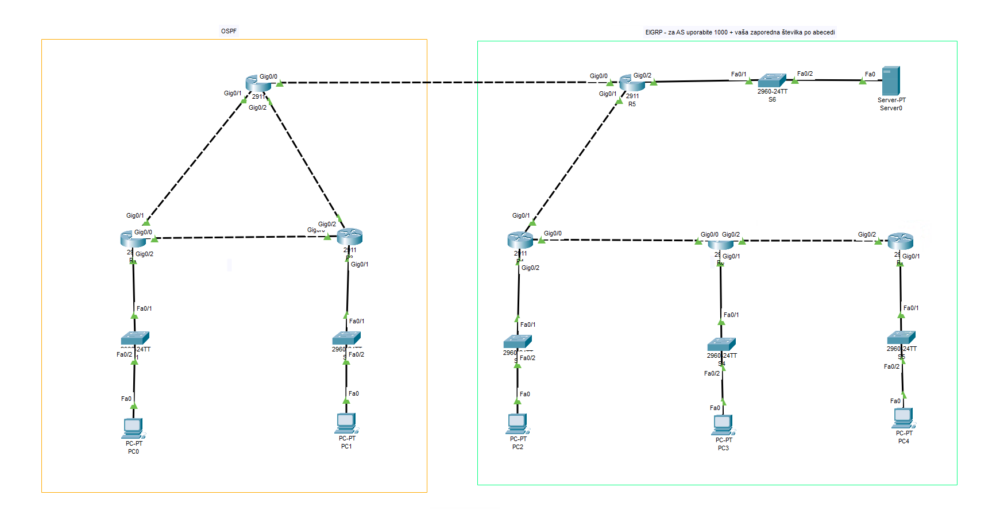

# LAV05 - Dinamično usmerjanje

Namen te vaje je postavitev večjega omrežja z uporabo dinamičnega usmerjanja.
Za hitrejše delo imate osnovno topologijo že pripravljeno v datoteki `LAV-05.pkt`.



Na usmerjevalnikih na levi strani bomo uporabljali OSPF, na usmerjevalnikih na desni strani pa EIGRP.
Pri konfiguraciji EIGRP za ASN uporabite 1000 + vaša zaporedna številka po abecedi (primer: 1000 + 1 = 1001).

## Tabela omrežij

| Lokacija       | Omrežje          |
| -------------- | ---------------- |
| `R1 - R2`      | `10.0.0.0/30`    |
| `R1 - R3`      | `10.0.0.4/30`    |
| `R2 - R3`      | `10.0.0.8/30`    |
| `R1 - PC0`     | `10.0.1.0/24`    |
| `R3 - PC1`     | `10.0.2.0/24`    |
| `R2 - R5`      | `192.5.3.32/30`  |
| `R5 - R4`      | `172.16.0.0/30`  |
| `R4 - R6`      | `172.16.0.4/30`  |
| `R6 - R7`      | `172.16.0.8/30`  |
| `R5 - Server0` | `200.5.4.128/25` |
| `R4 - PC2`     | `172.16.1.0/24`  |
| `R6 - PC3`     | `172.16.2.0/24`  |
| `R7 - PC4`     | `172.16.3.0/24`  |

Računalniki in strežnik naj imajo 10. IP naslov v omrežju, usmerjevalniki pa 1. ali 2. IP naslov v omrežju.

## Postopek

1. Omrežja iz zgornje tabele si označite na skico (lahko v packet tracerju ali na papirju). Zraven vmesnikov in računalnikov si zapišite IP naslov, ki ga boste uporabili. Če boste skico delali na papir pri oddaji priložite še sliko skice. **Brez skice z omrežji in IP naslovi vam naloga ne bo priznana**.

2. Nastavite IP naslove na računalnike in strežnik. Ne pozabite na privzete prehode (default gateway). DNS strežnik lahko pustite prazen, saj ga pri tej vaji ne bomo potrebovali.

3. Nastavite imena usmerjevalnikov z ukazom `hostname`.

4. Nastavite IP naslove na usmerjevalnike. Ker je teh veliko si lahko pomagate z beležnico ali podobnim programom:
    - v beležnico si napišite ukaze, s katerimi bi nastavili IP naslove na vseh vmesnikih, nato pa to kopirajte v CLI usmerjevalnika, to pa ponovite za vse usmerjevalnike
    - primer:
  
        ```txt
        ! R1
        interface gig0/0
            ip address 10.0.0.5 255.255.255.252
            no shutdown
            exit

        interface gig0/1
            ip address 10.0.0.1 255.255.255.252
            no shutdown
            exit

        interface gig0/2
            ip address 10.0.1.1 255.255.255.0
            no shutdown
            exit
        ```

    - če ste pogumni lahko to tehniko uporabite tudi za ostalo konfiguracijo (OSPF, EIGRP, `hostname`, ...)

    <div style="page-break-after: always;"></div>

5. Nastavite OSPF na usmerjevalnikih na levi strani. Primer za `R1`:

    ```txt
    router ospf 1
      ! tu napisete vsa omrezja, ki jih zelite oglasevati
      network 10.0.0.4 0.0.0.3 area 0
      network 10.0.0.0 0.0.0.3 area 0
      network 10.0.1.0 0.0.0.255 area 0
    ```

6. Preverite ali OSPF dela:
    - iz `PC0` pingajte `PC1` in `R2`
    - če ne dela preverite:
      - privzete prehode
      - pravilnost IP naslovov (`show ip interface brief` ali premaknite miško nad napravo za nekaj sekund)
      - usmerjevalne tabele (`show ip route`)
      - OSPF sosede (`show ip ospf neighbor`)

7. Nastavite EIGRP na usmerjevalnikih na desni strani. Primer za `R5`:

    ```txt
    ! pazi na ASN
    router eigrp 1000
      no auto-summary
      ! tu napisete vsa omrezja, ki jih zelite oglasevati
      network 200.5.4.128 0.0.0.127
      network 192.5.3.32 0.0.0.3
      network 172.16.0.0 0.0.0.3
    ```

8. Preverite ali EIGRP dela:
    - iz `PC2` pingajte `PC3` in `Server0`
    - če ne dela preverite:
      - privzete prehode
      - pravilnost IP naslovov (`show ip interface brief` ali premaknite miško nad napravo za nekaj sekund)
      - usmerjevalne tabele (`show ip route`)
      - EIGRP sosede (`show ip eigrp neighbors`)

    <div style="page-break-after: always;"></div>

9. Na `R2` nastavite redistribucijo med OSPF in EIGRP.
    - najprej morate tudi na `R2` nastaviti EIGRP
    - nato nastavite redistribucijo iz OSPF v EIGRP

        ```txt
        router eigrp 1000
          redistribute ospf 1 metric 1 1 1 1 1
        ```

    - nato nastavite redistribucijo iz EIGRP v OSPF

        ```txt
        router ospf 1
          redistribute eigrp 1000 subnets
        ```

10. Preverite ali lahko pingate med vsemi napravami
    - če ne dela preverite usmerjevalne tabele (`show ip route`)

11. Oddajte vajo na učilnico. Če ste skico delali na papir jo slikajte in priložite k oddaji.
