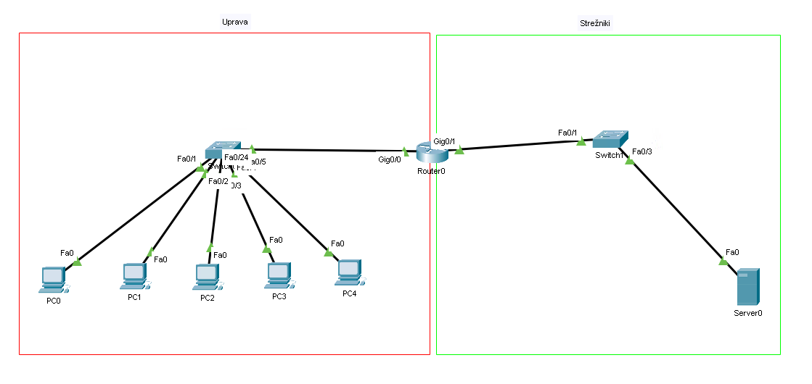
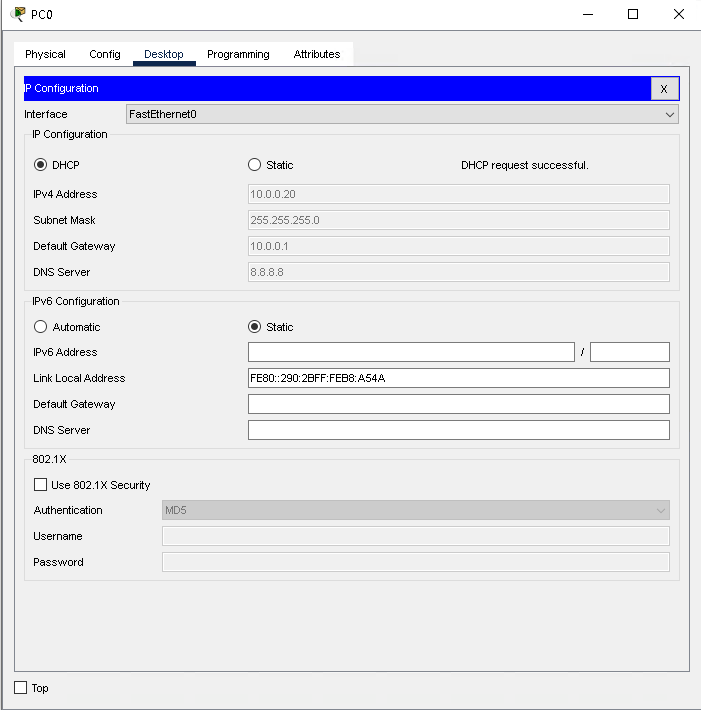
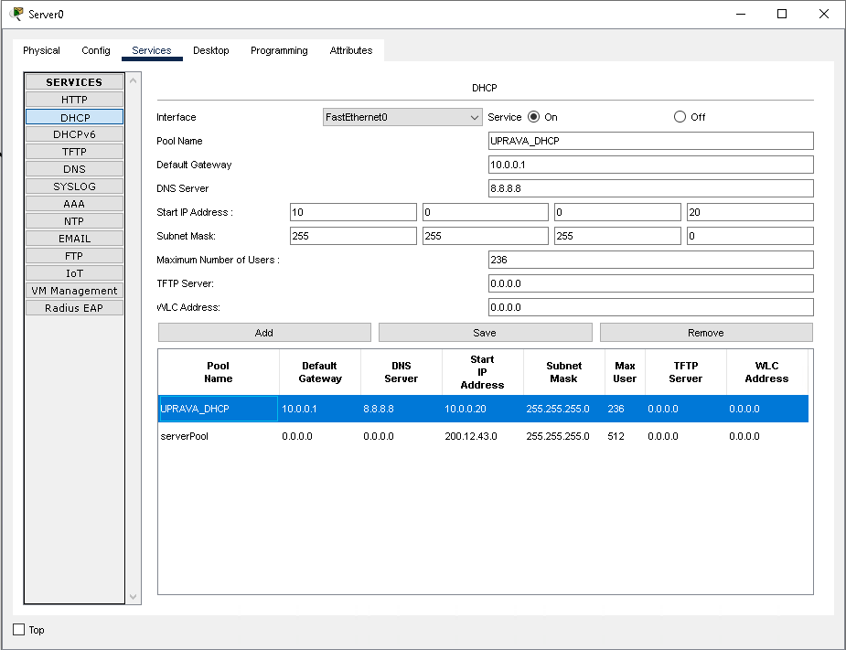

# LAV07 - DHCP

Če imamo v omrežju večje število računalnikov je ročno dodeljevanje IP naslovov zelo zamudno.
Namesto tega lahko uporabimo DHCP strežnik, ki bo računalnikom samodejno dodelil IP naslove in ostale pripadajoče nastavite (maska, privzeti prehod, naslov DNS strežnika, domena, ...).
Ta DHCP strežnik je lahko kar na usmerjevalniku ali pa na posebni napravi.

Ta vaje je sestavljena iz dveh delov:

- V prvem delu bomo DHCP nastavili na usmerjevalniku
- V drugem delu bomo DHCP nastavili na ločenem strežniku



Za upravo (levo) bomo uporabili omrežje `10.0.0.0/24`, za strežnike (desno) pa `200.12.43.0/24`.
    <div style="page-break-after: always;"></div>

## Naloge - del A

Na usmerjevalniku `R1` bomo nastavili DHCP strežnik za omrežje uprave.

0. Preden lahko nastavimo DHCP moramo na usmerjevalniku nastaviti IP naslove na vmesnikih.

1. Ponavadi nočemo, da DHCP strežnik dodeljuje vse naslove v omrežju, zato si nekaj naslovov rezerviramo za statične naslove (npr. za strežnike, usmerjevalnike, tiskalnike, ...), ki morajo vedno biti na istem naslovu.
Na usmerjevalniku to nastavimo z ukazom

    ```txt
    R1(config)# ip dhcp excluded-address ZACETNI_IP KONCNI_IP
    ```

    Če si želimo, da strežnik začne dodeljevati naslove od `10.0.0.20` dalje uporabimo ukaz

    ```txt
    R1(config)# ip dhcp excluded-address 10.0.0.0 10.0.0.19
    ```

2. Nato prižgemo DHCP strežnik in nastavimo vse potrebne nastavitve. Tem nastavitvam rečemo "pool". Na enem strežniku imamo lahko več poolov, ki dodeljujejo naslove v različnih omrežjih.

    ```txt
    R1(config)# ip dhcp pool UPRAVA_DHCP
    R1(dhcp-config)# default-router 10.0.0.1
    R1(dhcp-config)# network 10.0.0.0 255.255.255.0
    R1(dhcp-config)# dns-server 8.8.8.8           
    R1(dhcp-config)# domain-name vegova.si   
    ```

3. Na računalnikih namesto nastavljanja statičnega naslova vklopimo DHCP klient. Če je DHCP strežnik pravilno nastavljen bi morali v nekaj sekundah dobiti IP naslov in ostale nastavitve.

    

4. Z ukazom `show ip dhcp binding` lahko pogledamo kateri računalnik je dobil kateri IP naslov. (Kateri MAC naslov je dobil kateri IP naslov)

5. Narejeno shranite kot `LAV-07-A-ImePriimek.pkt` (shrani kot)

    <div style="page-break-after: always;"></div>

## Naloge - del B

Zdaj bomo DHCP strežnik nastavili na ločenem strežniku, ki je v drugem omrežju kot računalniki.

0. Najprej strežniku nastavite statični IP naslov, ne pozabite tudi na privzeti prehod.

1. Z ukazom `no ip dhcp pool UPRAVA_DHCP` lahko izbrišemo DHCP strežnik na usmerjevalniku `R1`.

2. DHCP strežnik nastavite na strežniku `Server0` (zavihek Services > DHCP). Nastavitve tu so podobne kot na usmerjevalniku. Ne pozabite vklopiti storitve `DHCP` in shraniti konfiguracije (gumb `Add` oz. `Save`)


3. Ker se nekateri DHCP paketki pošiljajo preko broadcastov (ki jih usmerjevalniki ne posredujejo) je potrebno na usmerjevalniku `R1` nastaviti `helper-address`. S tem usmerjevalniku povemo, da naj DHCP broadcast paketke vseeno posreduje DHCP strežniku.

    ```txt
    ! Vmesnik proti računalnikom
    R1(config)# interface g0/0             

    ! IP naslov DHCP strežnika        
    R1(config-if)# ip helper-address 200.12.43.10  
    ```

4. Na računalnikih izklopite in nazaj vklopite DHCP. Če je DHCP pravilno nastavljen boste v nekaj sekundah dobili IP naslov in ostale nastavitve.

5. Narejeno shranite kot `LAV-07-B-ImePriimek.pkt`

6. Obe datoteki oddajte na moodle.

## Pogoste napake

- Če računalnik napiše `DHCP failed. APIPA is being used` to pomeni, da ni dobil odgovora od DHCP strežnika in je zato uporabil APIPA (Automatic Private IP Addressing) in si sam poskusil dodeliti IP naslov. To je Windowsov način, da si sam izmisli IP naslov v primeru, da DHCP strežnik ne dela. Te naslovi so iz omrežja `169.254.0.0/16`.
