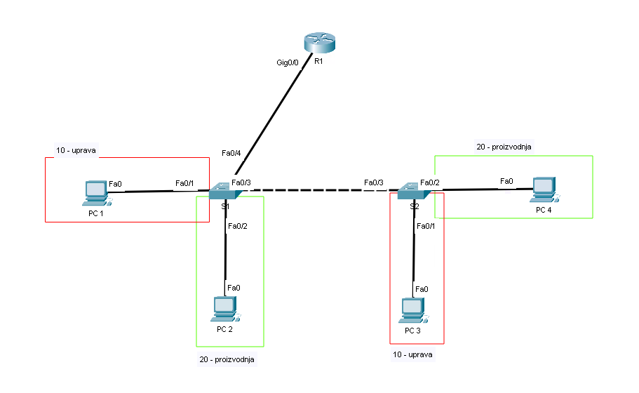

# LAV08 - VLAN

Namen te vaje je spoznati kako uporabljati VLANe in usmerjanje med njimi z uporabo router-on-a-stick.
Postavili bomo topologijo, ki bi jo lahko našli v kakšen manjšem podjetju.

To je prva vaja, kjer bomo poleg usmerjevalnika nastavili tudi stikala.
Konfiguracija stikal je zelo podobna kot pri usmerjevalnikih, le da nekateri ukazi ne delajo (na primer nastavljanje IP naslovov).



Če imamo veliko omrežij je ta najlažje zapisati v tabelo:

| VLAN | Ime         | Omrežje        |
| ---- | ----------- | -------------- |
| 10   | uprava | `10.0.10.0/24` |
| 20   | proizvodnja      | `10.0.20.0/24` |

V vsakem omrežju naj ima usmerjevalnik prvi uporabni naslov v omrežju  (default gateway).
Računalniki imajo lahko poljubne naslove v omrežju.
Če želite lahko za nastavljanje IP naslovov računalnikom uporabite DHCP strežnik na `R1`, drugače pa jih nastavite ročno.

## Naloga

1. Naredite si skico omrežja (papir ali PacketTracer) in si označite:
   1. imena naprav
   2. imena vmesnikov (**predvsem na stikalih**)
   3. omrežja/VLANe
   4. IP naslove

2. Na stikalih ustvarite VLANe. Na obeh stikalih naredite oba VLANa.

    ```txt
    S1(config)# vlan 10
    S1(config-vlan)# name uprava

    S1(config)# vlan 20
    S1(config-vlan)# name proizvodnja
    ```

3. Na vmesnikih stikal, ki so povezani z računalniki nastavite način `access` za željeni VLAN.

    Primer (ponovi na vseh vmesnikih tipa access - 4x):

    ```txt
    ! nastavi vmesnik f0/1 na VLAN 10

    S1(config)# interface f0/1
    S1(config-if)# switchport mode access
    S1(config-if)# switchport access vlan 10
    ```

    Z ukazom `show vlan brief` lahko preverite na kateri VLAN je nastavljen posamezen vmesnik.

    ```txt
    Switch#show vlan brief
    VLAN Name                             Status    Ports
    ---- -------------------------------- --------- -------------------------------
    1    default                          active    Fa0/5, Fa0/6, Fa0/7, Fa0/8
                                                    Fa0/9, Fa0/10, Fa0/11, Fa0/12
                                                    Fa0/13, Fa0/14, Fa0/15, Fa0/16
                                                    Fa0/17, Fa0/18, Fa0/19, Fa0/20
                                                    Fa0/21, Fa0/22, Fa0/23, Fa0/24
                                                    Gig0/1, Gig0/2
    10   uprava                           active    Fa0/1
    20   proizvodnja                      active    Fa0/2
    1002 fddi-default                     active    
    1003 token-ring-default               active    
    1004 fddinet-default                  active    
    1005 trnet-default                    active    
    ```
    <div style="page-break-after: always;"></div>
4. Na vmesnikih stikal, ki so povezani z drugim stikalom ali usmerjevalnikom nastavite način `trunk`.

    Primer (ponovi na vseh vmesnikih tipa trunk - 3x):

    ```txt
    ! nastavi vmesnik f0/3 na trunk

    S1(config)# interface f0/3
    S1(config-if)# switchport mode trunk
    S1(config-if)# switchport trunk allowed vlan 10,20
    ```

5. Na usmerjevalniku nastavite router-on-a-stick.

    Vklopi fizični vmesnik

    ```txt
    R1(config)# interface g0/0
    R1(config-if)# no shutdown
    ```

    Ustvari podvmesnike in nastavi IP naslov (ponovi za vsak VLAN - 2x):

    ```txt
    R1(config)# interface g0/0.10
    R1(config-subif)# encapsulation dot1q 10
    R1(config-subif)# ip address 10.0.10.1 255.255.255.0
    ```

6. Za večjo varnost bomo izklopili vse vmesnike stikal, ki jih ne uporabljamo. Na `S1` so to vmesniki od `f0/5` do `f0/24` ter vmesnika `g0/1` in `g0/2`.

    ```txt
    S1(config)# interface range f0/5-24
    S1(config-if-range)# shutdown

    S1(config)# interface range g0/1-2
    S1(config-if-range)# shutdown
    ```

7. Preverite ali lahko iz vsakega računalnika pingate vse ostale računalnike in usmerjevalnik.
