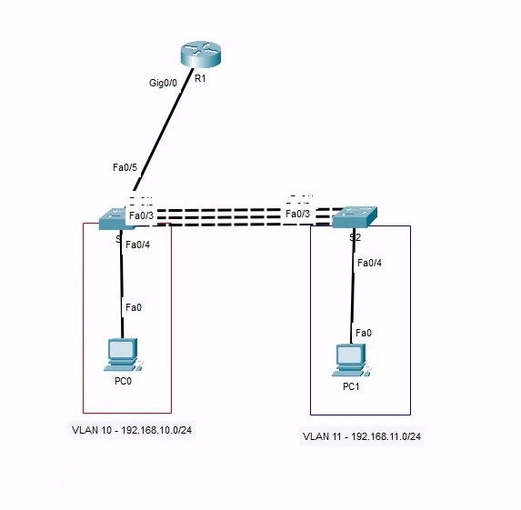

# LAV09 - EtherChannel

Včasih na neki povezavi potrebujemo večjo zanesljivost in večjo hitrost.
To najlažje dosežemo tako, da napravi (ponavadi stikali) povežemo z več kabli, te pa združimo v eno logično povezavo.
Protokol, ki to omogoča se imenuje EtherChannel.

Vaja je zelo podobna LAV08, le da tokrat bomo tokrat oddali še EtherChannel.
Za bolj podrobno razlago ukazov/postopkov si lahko pogledate pdf tiste vaje.
Tu so napisni le kratki izseki, s katerimi si lahko pomagate, da se spomnite ukazov.



Na usmerjevalniku uporabite prvi uporabni naslov v vsakem omrežju.

Bodite pozorni kam vklopite kable na stikalih.
Priporočam uporabo zaporednih vmesnikov, na primer `f0/1`, `f0/2`, `f0/3`.

## Naloga

1. Na list papirja si naredite skico na kateri označite:
   1. imena naprav
   2. imena vmesnikov (pazi: imamo router-on-a-stick)
   3. omrežja/VLANe
   4. IP naslove

2. Postavite omrežje v Packet Tracerju
    - opazili boste, da sta dve povezavi med stikali izklopljeni (rdeče lučke). To je OK, saj tako stikala preprečijo zanke v omrežju (protokol STP).

3. Nastavi IP naslove in privzete prehode na računalnikih

4. Ustvari VLANe na stikalih

    ```txt
    S(config)# vlan 10
    S(config-vlan)# name uprava
    ```

    <div style="page-break-after: always;"></div>
5. Nastavi access in trunk vmesnike na stikalih

    ```txt
    S(config)# interface f0/24
    S(config-if)# switchport mode access
    S(config-if)# switchport access vlan 10

    S(config)# interface range f0/1-3
    S(config-if)# switchport mode trunk
    S(config-if)# switchport trunk allowed vlan 10,11
    ```

6. Nastavi EtherChannel med stikaloma. Konfiguracija je enaka na obeh stikalih.
    Najprej boste dobili kup opozoril (ker nastavitve na obeh stikalih še ne bodo enake), nato pa bodo vse lučke postale zelene.

    ```txt
    S(config)# interface range f0/1-3
    S(config-if-range)# channel-group 1 mode active
    ```

7. Nastavi router-on-a-stick na usmerjevalniku

    ```txt
    R1(config)# interface g0/0
    R1(config-subif)# no shutdown

    R1(config)# interface g0/0.10
    R1(config-subif)# encapsulation dot1Q 10
    R1(config-subif)# ip address 192.168.10.2 255.255.255.0
    ```

8. Preveri če vse dela. Ping med računalnikoma mora uspeti tudi če izklopiš eno ali celi dve povezavi med stikali.
