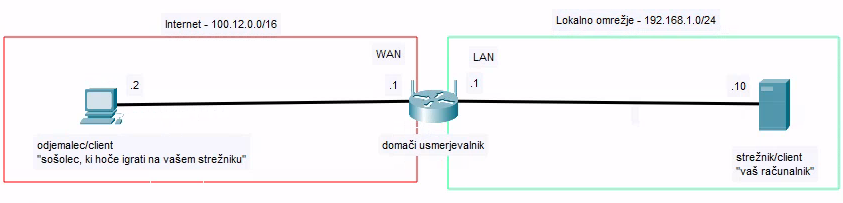
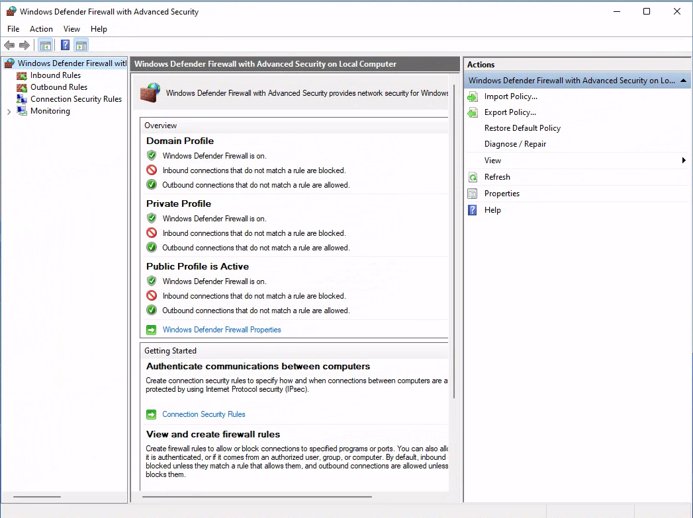
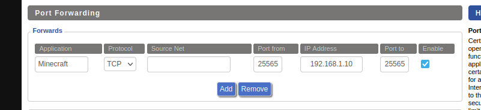

# LAV11 - Postavitev Minecraft Strežnika

S postavitvijo Minecraft strežnika se lahko spoznamo s kopico konceptov, ki so uporabni tudi pri postavitvi bolj resnih strežnikov.
Pri tej vaji bomo spoznali:

- uporabo domačih (consumer) usmerjevalnikov
- port forwarding
- požarne zidove na Windowsih
- osnove administracije strežnika

Vajo boste delali v parih, saj boste potrebovali 2 računalnika. Enega za strežnik (predstavlja vaš računalnik, kjer imeli Minecraft strežnik) in enega za odjemalca (predstavlja ostale, ki se prek interneta povežejo na vaš strežnik).



## Strežnik

### Postavitev Minecraft strežnika

Na računalniku, ki bo deloval kot strežnik, namestite Minecraft server.

1. Iz <https://www.minecraft.net/en-us/download/server> prenesite datoteko `.jar` s strežnikom.
2. Datoteko shranite v novo mapo, kjer boste imeli vse datoteke strežnika, npr `Documents/minecraft_server`.
3. V tej mapi naredite še dodateko `start.bat` z naslednjo vsebino:

    ```bat
    @echo off

    java -Xmx1024M -Xms1024M -jar server.jar nogui
    ```

   kjer `server.jar` nadomestite z imenom datoteke, ki ste jo prenesli.
    Pomen parametrov:
    - `-Xmx1024M` - največja količina RAM-a, ki jo lahko strežnik uporabi
    - `-Xms1024M` - najmanjša količina RAM-a, ki jo strežnik uporabi
    - `-jar server.jar` - datoteka, ki jo poženemo
    - `nogui` - strežnik se zažene brez grafičnega vmesnika (poskusite brez tega)
4. Iz ukazne vrstice poženite `start.bat` in počakajte, da se strežnik zažene. Prvi zagon bo neuspešen, vseeno pa vam bo ustvaril datoteke, ki jih potrebuje.
5. V datoteki `eula.txt` spremenite `eula=false` v `eula=true`. S tem potrjujete, da se strinjate z licenčnimi pogoji.
6. V datoteki `server.properties` spremenite `online-mode=true` v `online-mode=false`. S tem Minecraft server ne bo preverjal veljavnosti Minecraft računov. Po želji lahko tu spremenite tudi kake druge nastavitve.
7. Ponovno poženite `start.bat` in počakajte, da se strežnik zažene.

### Statični IP naslov

Strežnik potrebuje statični IP naslov, na katerega se bodo lahko povezali odjemalci.

Računalniku, ki se obnaša kot strežnik nastavite statični IP naslov `192.168.1.10`. Nastavitev poskusite najti sami.

### Požarni zid

Windowsi privzeto ne dovolijo dostopa do TCP vrat 25565, ki jih uporablja Minecraft strežnik.
Preprosta rešitev bi bila, da izklopimo celoten požarni zid, vendar to ni varna rešitev.
Raje bomo v požarnem zidu odprli le vrata, ki jih potrebujemo (TCP 25565).

1. Pritisnite `Win` + `R` in vpišite `firewall.cpl` ter pritisnite `Enter` (ali kako drugače pridite do spodaj prikazenga okna)
2. Na levi kliknite na "Advanced settings", prikazati se vam bi moralo spodnje okno
    
3. Na levi kliknite na "Inbound rules" in nato na desni "New Rule..."
4. Dodali bomo pravilo za TCP vrata 25565. Izberite "Port" in kliknite "Next".
5. Izberite "TCP" in vpišite "25565" ter kliknite "Next".
6. Izberite "Allow the connection" in kliknite "Next".
7. Označite "Domain", "Private" in "Public" in kliknite "Next".
8. Vpišite ime pravila, npr. "Minecraft server" in kliknite "Finish".

## Usmerjevalnik

Vsak usmerjevalnik je malo drugačen, zato se boste tu morali do neke mere znajti sami.
Včasih imajo nastavitve različna imena ali so na različnih mestih, vendar imajo skoraj vsi usmerjevalniki vsaj te osnovne funkcionalnosti, ki jih potrebujemo danes.

### Povezava na usmerjevalnik

Svoj računalnik vklopite v LAN vmesnik usmerjevalnika in v brskalnik napišite IP naslov usmerjevalnika.
Zelo pogost je `192.168.1.1` (tudi v našem primeru), vendar je to odvisno od proizvajalca usmerjevalnika.
Če vas vpraša za uporabniško ime in geslo ju vpišite.
Privzeto uporabniško ime in geslo je pogosto `admin` in `admin`, `user` in `user` ali pa je napisano na nalepki na usmerjevalniku.
Privzeta gesla lahko hitro najdete tudi na spletu.

Ko pridete v nastavitve usmerjevalnika se razglejte in poglejte kaj vse vam omogoča.

### WAN IP naslov

Na WAN vmesniku usmerjevalnika (tisti, ki je povezan na internet) boste potrebovali statični IP naslov.
Ponavadi je to javni IP naslov, ki vam ga dodeli vaš ponudnik internetnih storitev, mi pa ga bomo nastavili ročno.

Najdite nastavitev "WAN Connection" ali kaj podobnega in nastavite statični IP naslov.
Pazi: IP naslov na teh usmerjevalnikih bo delal le če ima masko `/16`!

### DHCP

Na LAN vmesnikih usmerjevalnika (tisti, ki so povezani na lokalno omrežje) je privzeto vklopljen DHCP.
Tega bomo pustili vklopljenega, vendar bomo zaradi lažje administracije strežniku dodelili statični IP naslov.
Vseeno pa je dobro vedeti, kje se to nastavi, če bi ga kdaj želeli izklopiti ali spremeniti.

### Port forwarding

Port forwarding je postopek, kjer usmerjevalnik preusmeri promet, ki pride na določena vrata (port) na WAN vmesnik usmerjevalnika na določen računalnik v lokalnem omrežju.
Mi bomo preusmerili promet, ki pride na TCP vrata 25565 na računalnik, kjer imamo Minecraft strežnik.

Najdite nastavitve port forwardinga in dodajte novo pravilo, ki naj zgleda podobno spodnji sliki.
    
Vsak usmerjevalnik ima te nastavitve malo drugačne, vendar imajo skoraj vsi podobna polja:

- ime aplikacije, kjer napišene poljubno ime (npr. "Minecraft server")
- zunanja vrata, kjer napišete "25565" (včasih je to eno polje, včasih pa lahko določite območje od-do)
- protokol, kjer izberete "TCP" (opcije so ponavadi TCP, UDP, oboje)
- IP naslov, kamor se preusmeri promet, tu napišete IP naslov računalnika, kjer imate Minecraft strežnik
- notranja vrata, kjer napišete "25565" (včasih je to eno polje, včasih pa lahko določite območje od-do. Ponavadi pustimo enako kot zunanje vrata).

## Objemalec

Na odjemalcu:

1. naložite Minecraft Launcher (program, ki zažene Minecraft). Uporabite lahko priloženo datoteko `PrismLauncher-Windows-MSVC-Setup-7.1.exe` ali pa po želji uporabite kak drug launcher.

   - naredite nov "Offline" profil
   - naložite najnovejšo različico Minecrafta

2. nastavite statični IP naslov, kot za strežnik (to bi ponavadi naredil DHCP, a ker je ta računalnik povezan na WAN vmesnik usmerjevalnika, moramo to narediti ročno). Nastavite IP naslov `100.12.0.2` z masko `/16`.
