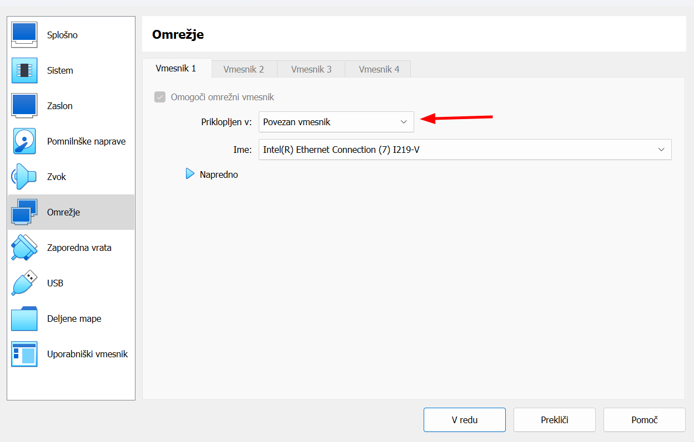
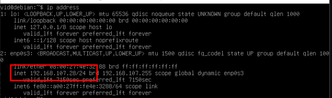

# LAV12 - Osnove administracije Linux strežnikov

Velik del spleta temelji na storitvah, ki tečejo na Linux strežnikih, zato je vredno poznati vsaj osnove uporabe in administracije takih sistemov.
Na teh vajah bomo spoznali:
    - način za oddaljen dostop do strežnika
    - načine za prenos datotek med napravami
    - samodejno zaganjanje procesov po določenem urniku (`cron` in `systemd`)

Uporabili bomo VM z nameščenim operacijskim sistemom Ubuntu Server.
Geslo za uporabnika `dijak` je `dijak`.

## Priprava

V VirtualBox dodajte VM iz datoteke `VOS.vdi`, ki jo dobite v deljeni mapi.
V VirtualBoxu naredite nov VM in mu dodajte ta disk.

## Oddaljen dostop do strežnika

Pisanje ukazov neposredno v terminal na strežniku je lahko zelo nepraktično, saj nimamo podpore za

- kopiranje in lepljenje (copy-paste),
- pomikanje po izpisu (scroll),
- dostop prek več terminalov hkrati.

Hkrati pa moramo biti zraven strežnika (pisanje v VirtualBox konzolo je kot pisanje na tipkovnici, ki je vklopljena direktno v strežnik),
radi pa bi delali tudi oddaljeno.

Zato si bomo najprej pogledali kako se na strežnik povezati na boljši način.
Za oddaljeni dostop do strežnika prek terminala lahko uporabimo protokol SSH.
Predstavljate si ga lahko kot TeamViewer za terminal.

Najprej moramo VMu nastaviti omrežje na način "bridged" oz "povezan", da bo dobil IP naslov iz istega omrežja kot naša naprava (dela se kot še ena računalnik v našem omrežju).



Nato pa lahko z ukazom `ip address` v VM dobimo IP naslov.
Če ste VM nastavili na "bridged"/"povezan" ampak vam ne kaže IP naslova iz omrežja `192.168.107.0/24` (vsaj v učilnici 107) poženite še ukaz `sudo systemctl restart systemd-networkd` ali ponovno zaženite VM.



### SSH

SSH je moderni standard za oddaljeni dostop do strežnikov, usmerjevalnikov, stikal in drugih naprav.
Na vaših računalnikih se lahko na strežnik povežete z ukazom:

```sh
ssh dijak@<ip-naslov-VMa>
```

Prvič vpraša ali se želite povezati z neznanim strežnikom, kar potrdite z "yes"
Ko vpisujete geslo ne boste videli znakov.
To je na linuxih zelo pogosto.

Za bolj varno povezavo (in ker se nam ne da pisati gesla) lahko uporabimo SSH ključ.
Tega moramo naprej generirati na našem računalniku, nato pa ga kopirati na strežnik.
Na linuxih se da to vse narediti samodejno, na Windowsih pa moramo to narediti ročno.

Naredimo SSH ključ:

```sh
ssh-keygen      # vpraša kam shranimo, privzeto je ok, gesla ne nastavljajte
```

zgornji ukaz vam v mapi `C:\Uporabniki\<uporabnik>\.ssh` ustvari 2 datoteki:

- `id_rsa` zasebni ključ **ne smete ga deliti z nikomer**
- `id_rsa.pub` - javni ključ **lahko ga poljubno delite**

Vsebino javnega ključa kopirajte in prilepite v spodnji ukaz, ki ga izvedete v VM prek SSH:

```sh
# Naredi mapo .ssh, v tej mapi naredi datoteko authorized_keys in vanjo zapiše javni ključ
mkdir ~/.ssh; echo "<vsebina javnega ključa>" >> ~/.ssh/authorized_keys
```

Sedaj se lahko na strežnik povežemo brez gesla, saj SSH samodejno uporabi ključ, ki je shranjen v `C:\Users\<uporabnik>\.ssh\id_rsa` (Windows) oz. `~/.ssh/id_rsa` (Linux).

```sh
ssh dijak@<ip-naslov-VMa>
```

Še vedno pa rabimo pisati IP naslov VMa.
Namesto tega si bomo nastavili "bližnjico" (alias) za povezavo do VMa.

V datoteko `C:\Users\<uporabnik>\.ssh\config` (Windows) oz. `~/.ssh/config` (Linux) dodamo naslednje vrstice:

```sh
Host vos
    HostName <ip-naslov-VMa>
    User dijak
```

Sedaj se lahko povežemo na VM z ukazom:

```sh
ssh vos
```

Taka konfiguracija je še posebej uporabna če imamo veliko strežnikov.

## Prenos datotek na strežnik

Ko imamo vzpostavljeno SSH povezavo do strežnika jo lahko uporabimo tudi za prenos datotek.

Obstaja kopica protokolov za varen prenos datotek prek SSH

- scp (secure copy): preprost, dela na Linuxih in Windowsih
- sftp (secure file transfer protocol): več možnosti, dela na Linuxih in Windowsih
- rsync: (remote sync): hitrejši, še več možnosti, dela le na Linuxih

### scp

Vzorec za uporabo ukazov `scp` in `rsync` je:

```sh
scp <kaj> <kam>
```

"Kaj" in "kam" sta datoteki ali mapi, ki jih želimo prenesti.
Lahko sta na našem računalniku ali na strežniku.
Če je na strežniku, moramo napisati še naslov strežnika (`dijak@<ip-naslov-VMa>:`) ali bližnjico (`vos:`) pred potjo do mape.

Primeri:

1. Prenos datoteke `C:\test.txt` iz računalnika v mapo `/var/tmp` na VMu

    ```sh
    scp C:\test.txt vos:/var/tmp
    ```

2. Prenos mape `C:\Users\<uporabnik>\Downloads` iz računalnika v mapo `/home/dijak` na VMu (`-r` pomeni rekurzivno kopiranje, kar potrebujemo, če kopiramo mape)

    ```sh
    scp -r C:\Users\<uporabnik>\Downloads vos:/home/dijak
    ```

3. Prenos datoteke `streznik.txt` iz mape `/var/tmp` na VMu v mapo `C:\Users\<uporabnik>\Downloads` na računalniku

    ```sh
    scp vos:/var/tmp/streznik.txt C:\Users\<uporabnik>\Downloads
    ```

### SFTP

SFTP namesto ukazov uporablja interaktivno lupino, ki nam omogoča navigacijo po datotečnem sistemu strežnika in prenos datotek.

Najprej se povežemo na strežnik:

```sh
sftp vos
```

Nato se s `cd` premikamo po datotečnem sistemu strežnika, z `ls` si ogledujemo datoteke in mape, z `get` prenašamo datoteke iz strežnika na naš računalnik, s `put` pa iz računalnika na strežnik.

```sh
cd /var/tmp
ls
get test.txt    # Prenese iz VM na računalnik
put test.txt    # Prenese iz računalnika na VM
```

### rsync

`rsync` je podoben `scp`, vendar je hitrejši, saj prenese samo spremembe v datotekah.
Na Linuxu ga naložimo z ukazom `sudo apt install rsync`.

Uporaba je enaka kot pri `scp`

```sh
rsync <kaj> <kam>
```

Uporabljamo ga lahko tudi za kopiranje datotek na enem strežniku. Tu bomo dodali še nekaj zastavic

- `-a` (archive): ohrani vse lastnosti datotek (lastnik, dovoljenja, čas spremembe, ...)
- `-v` (verbose): izpiše kaj se dogaja

    ```sh
    rsync -av <datoteka> <ciljna-mapa>
    ```

## Samodejno zaganjanje procesov

Na strežnikih pogosto želimo programe zagnati ob določenem času.
Primeri:

- zaženemo varnostno kopiranje vsak dan ob 2h zjutraj
- vsakih 5 minut preverimo, če je kdo poslal sporočilo
- vsako minuto kopiramo vsebino ene mape v drugo

To lahko naredimo z orodjema `cron` (preprost) ali `systemd` (malo več konfiguracije, a tudi več možnosti).
Tu bomo spoznali samo `cron`.

Konfiguriramo ga lahko z ukazom `crontab -e`, kjer lahko dodamo vrstice, ki določajo kdaj in kaj se bo izvedlo.
Prvih 5 stolpcev določa kdaj se bo izvedel ukaz, zadnji pa kaj se bo izvedlo.
Za pomoč pri določanju kdaj se bo izvedel ukaz lahko uporabimo razna spletna orodja.
Moj najljubši je <https://crontab.guru/>.

Primera:

```sh
# vsak dan ob 2h zjutraj zaženi ukaz /var/tmp/backup.sh
0 2 * * * /var/tmp/backup.sh

# vsakih 5 minut zaženi ukaz /var/tmp/checkmail.sh
*/5 * * * * /var/tmp/checkmail.sh
```

## Naloge

Na moodlu je poleg tega dokumenta še datoteka mapa z raznimi datotekami.

0. Naredite mapo `cats` v `/home/dijak` na VMu.
1. Z uporabo  `scp` prenesite datoteko `naloga1/cat0.jpeg` na VM v mapo `/home/dijak/cats`.
2. Z uporabo `sftp` prenesite datoteki `naloga2/cat1.png` in `naloga2/cat2.jpeg` na VM v mapo `/home/dijak/cats`.
3. Prenesite celotno mapo `naloga3` na VM v mapo `/home/dijak/cats` z uporabo `scp`.
4. Prenesite celotno mapo `naloga4` na VM v mapo `/home/dijak/cats` z uporabo `sftp`.

5. Poskusite večkrat pognati ukaz

    ```sh
    rsync -av /home/dijak/cats /var/tmp
    ```

    in opazujte speedup.
    Prvič bo enak 1, ker rabi prekopirati vse datoteke, naslednjič pa bo večji od 1, ker bo prenesel samo spremembe (lahko je tudi več tisočkratna pospešitev).

6. Nastavite `cron` tako, da bo vsako minuto kopiral vsebino mape `/home/dijak/cats` v mapo `/var/tmp/cats`. Preverite delovanje tako, da v `/var/tmp/cats` dodate datoteko in počakate minuto.
